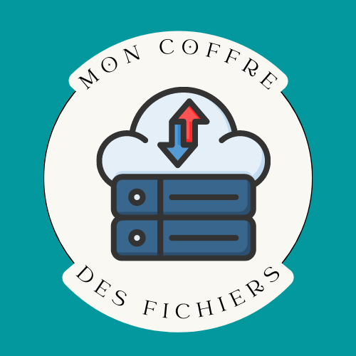

     

  
  

        

# Installation
### Cloner le dépot
    git clone https://github.com/Appryll/Mon-coffre-des-fichiers.git

### Se déplacer dans le dossier
    cd mon_coffre_des_fichiers

### Installer les dépendances
    composer install

### Configurer la connection pour votre BDD dans .env
>Pour ce faire, créer un fichier .env et :
> 1. Définir votre APP_SECRET
> 2. Configurer l'accès à votre base de données mysql en enregistrant votre nom d'utilisateur mysql, votre mot de passe mysql et votre port.

>Utiliser le fichier .env.example comme exemple (si vous le souhaitez, vous pouvez le compléter et le renommer en .env)
### Créér la base de données
    php bin/console doctrine:database:create

### Exécuter les migrations
    php bin/console doctrine:migrations:migrate

### Lancer le serveur
    php -S 127.0.0.1:8000 -t public

(Ce code sert uniquement de test d'evaluation technique sur PHP !)